<div align="center">
  
</div>

<p align="center">
  <a href="./README.md"></a>
  <a href="./README.zh-CN.md"></a>
</p>

<p align="center">
  <code>全干工程师</code> · <code>前端偏多</code>
</p>

---

## `$ whoami`

我是 Leo，一名**全干工程师**，平时前端做得多一些。

主要做 Web 和桌面端开发，也写后端、管部署和运维。我喜欢从零开始做东西，也喜欢把已经能跑的东西打磨得更顺手。

## `$ stack --grouped`

```text
前端      TypeScript · JavaScript · React · Vue · Next.js
后端      Node.js · NestJS
桌面端    Electron
运维      Docker · 环境配置 · 构建发布 · 问题排查
工具      Vite · Git
学习中    Go
```

<p align="center">
  
</p>

## `$ ls ./代表项目`

| 项目 | 用途 | 技术 |
| --- | --- | --- |
| [**Outclaw**](https://github.com/leocarsons/outclaw) | 我写的一个 CLI，让 Agent Skills 的创建、安装、搜索和管理简单一点。 | TypeScript · CLI |
| [**vite-plugin-upload-sourcemaps**](https://github.com/leocarsons/vite-plugin-upload-sourcemaps) | 一个把 Sourcemap 上传到 APM Insight Web 的小型 Vite 插件。 | TypeScript · Vite |

## `$ cat 随手记.txt`

我喜欢有细节的界面、能解决真实麻烦的小工具，以及不会让后来接手的人叹气的代码。

最近在慢慢补 Go，也还在找各种理由写 Electron。

<p align="center">
  <samp>leo@github:~$ <b>继续写点东西。</b> <span>▌</span></samp>
</p>
