<div align="center">
  
</div>

<p align="center">
  <samp><a href="./README.md">English</a> · <b>简体中文</b></samp>
</p>

<p align="center">
  <code>偏前端的全栈工程师</code> · <code>Web 与桌面端</code> · <code>偏好远程</code>
</p>

---

## `$ whoami`

我是 Leo，一名偏前端的全栈工程师，喜欢把产品想法做成可靠、精致且真正可用的 Web 与桌面端体验。

- 🎨 前端是主要优势，主力技术包括 **TypeScript、React、Vue 和 Next.js**
- ⚙️ 使用 **Node.js 和 NestJS** 开发 API、后端服务与全栈功能
- 🖥️ 使用 **Electron** 开发跨平台桌面应用
- 📦 使用 **Docker、Vite 和 Git** 改善开发、构建与交付流程
- 🌱 正在学习 **Go**，逐步拓展后端与系统方向的能力边界
- 🤖 探索 AI 在创意产品与开发者工具中的实际应用

## `$ cat stack.ts`

```ts
const 技术栈 = {
  前端: ["TypeScript", "JavaScript", "React", "Vue", "Next.js"],
  后端: ["Node.js", "NestJS"],
  桌面端: ["Electron"],
  工程化: ["Docker", "Vite", "Git"],
  学习中: ["Go"],
} as const;
```

<p align="center">
  
</p>

## `$ ls ./代表项目`

| 项目 | 用途 | 技术 |
| --- | --- | --- |
| [**Outclaw**](https://github.com/leocarsons/outclaw) | 用于创建、安装、搜索和管理 Agent Skills 的 CLI 与注册表工作流。 | TypeScript · CLI |
| [**vite-plugin-upload-sourcemaps**](https://github.com/leocarsons/vite-plugin-upload-sourcemaps) | 面向 APM Insight Web 的 Vite Sourcemap 上传工具。 | TypeScript · Vite |

## `$ cat 工作方式.json`

```json
{
  "产品意识": true,
  "沟通方式": "清晰且适合异步协作",
  "文档": "工作的一部分",
  "交付": "可靠、渐进",
  "偏好模式": "远程"
}
```

<p align="center">
  <samp>leo@github:~$ <b>想清楚，认真做，持续进步。</b> <span>▌</span></samp>
</p>
